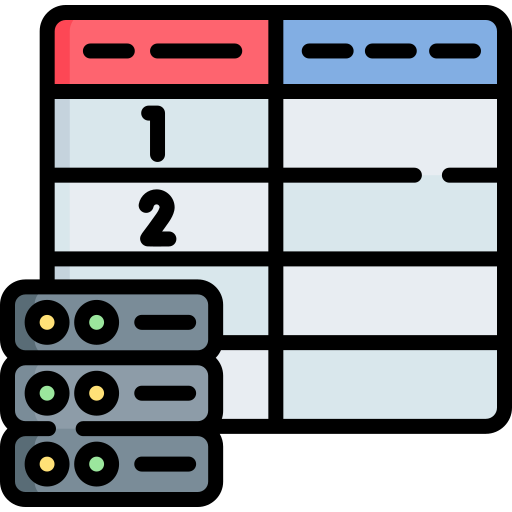

# alura-libros
Challenger sobre libros propuesto por Alura

# Challenger-Libros-Alura.
<b><h3>Bienvenidos al Challenger sobre Libros propuesto por Alura.</h3></b> 
<b><h2>Video de la aplicación:</h2></b>

<b><h2>Desarrollo Challenger Libros:</h2></b>

Se utilizará la api de Gutendex para buscar informacion sobre libros en linea  https://gutendex.com/ 

<h2 id="indice">Índice de la Página</h2>

<ol>
  <li><a href="#seccion1">Instalación.</a></li>
  <li><a href="#seccion2">Software y Herramientas Utilizadas.</a></li>
  <li><a href="#seccion3">Estructura del Proyecto.</a></li>
  <li><a href="#seccion4">Tabla Postgres.</a></li>
  <li><a href="#seccion7">GIT</a></li>
</ol>

#  Instalación.
<h2 id="seccion1">Instalación</h2>

<ol>
  <li>Clona este repositorio en tu máquina local:  git clone
   https://github.com/edcastilla/alura-libros</li>
  <li>Abre el proyecto en su IDE Favorito.</li>
  <li>Recuerda tener instalado Java en su sistema.</li>
</ol>
  

  
 <a href="#indice"><button>Ir al Índice</button></a> 
 
# Software y herramientas utilizadas.
<h2 id="seccion2">Software y herramientas utilizadas.</h2>
<ul>
    <li><b>IntelliJ id. link :&nbsp;https://www.jetbrains.com/es-es/idea/ </li>
    <li><b>Spring initializr. link :&nbsp;https://start.spring.io/</li>
    <li><b>Postgres . link :&nbsp;https://www.postgresql.org/download/</li>
    <li><b>Postman. link :&nbsp;https://www.postman.com/</li>
    <li><b>Java 17. link :&nbsp;https://www.oracle.com/java/technologies/downloads/ </li>
    <li><b>Spring data jpa. link :https://docs.spring.io/spring-data/jpa/reference/ </li>
   <li><b>Maven Repository. link :&nbsp;https://mvnrepository.com/ </li>
</ul>
<a href="#indice"><button>Ir al Índice</button></a>

# Estructura del proyecto.
<h2 id="seccion3">Estructura del proyecto.</h2>

<a href="#indice"><button>Ir al Índice</button></a>

# Tabla en Postgres.
<h2 id="seccion4">Tabla en Postgres.</h2>

<a href="#indice"><button>Ir al Índice</button></a>
<h2 id="seccion7">GIT</h2>

<b> GIT</b> 

<a href="#indice"><button>Ir al Índice</button></a> 
<ol>
  <li>git init  </li>
  <li>git status</li>
  <li>git add .</li>
  <li>git push</li>
</ol>

# Autor Edgar Castilla

